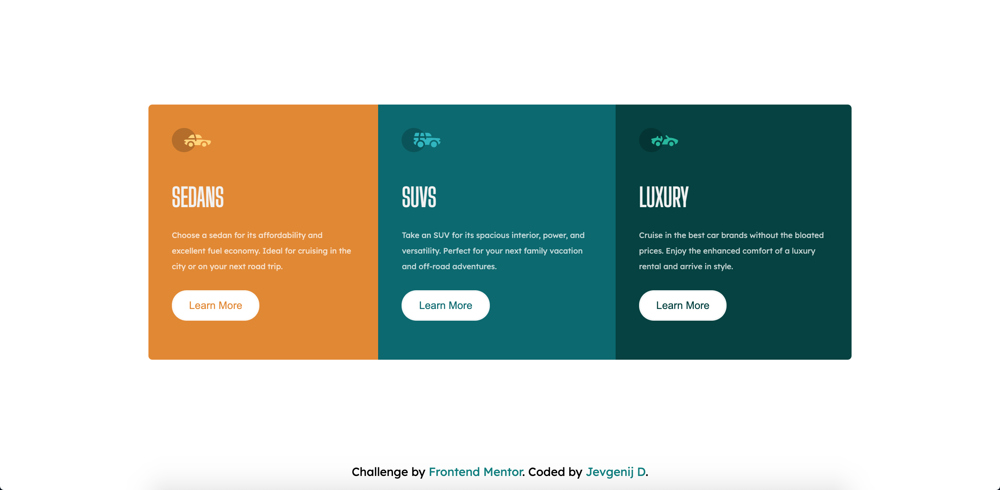

# Frontend Mentor - 3-column preview card component solution

This is a solution to the [3-column preview card component challenge on Frontend Mentor](https://www.frontendmentor.io/challenges/3column-preview-card-component-pH92eAR2-). Frontend Mentor challenges help you improve your coding skills by building realistic projects. 

## Table of contents

- [Overview](#overview)
  - [The challenge](#the-challenge)
  - [Screenshot](#screenshot)
  - [Links](#links)
- [My process](#my-process)
  - [Built with](#built-with)
  - [What I learned](#what-i-learned)
  - [Useful resources](#useful-resources)
- [Author](#author)

## Overview

### The challenge

Users should be able to:

- View the optimal layout depending on their device's screen size
- See hover states for interactive elements

### Screenshot



### Links

- Solution URL: [Here](https://your-solution-url.com)
- Live Site URL: [Here](https://your-live-site-url.com)

## My process

### Built with

- Semantic HTML5 markup
- CSS custom properties
- Flexbox
- Mobile-first workflow

### What I learned

I learned how to make cutout text using
```css
color: black;
mix-blend-mode: screen;
```

### Useful resources

- [Cutout text](https://www.w3schools.com/howto/howto_css_cutout_text.asp) - This helped me to make cutout text on the buttons.

## Author

- My Github - [TScorpz](https://github.com/TScorpz)
- LinkedIn - [Jevgenij D](https://www.linkedin.com/in/jevgenij-dachno-5403b696/)
- Frontend Mentor - [@TScorpz](https://www.frontendmentor.io/profile/TScorpz)